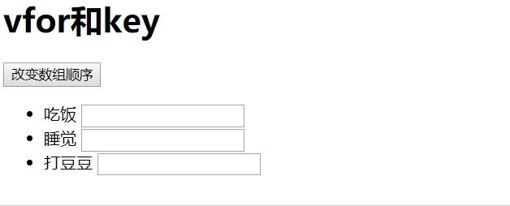
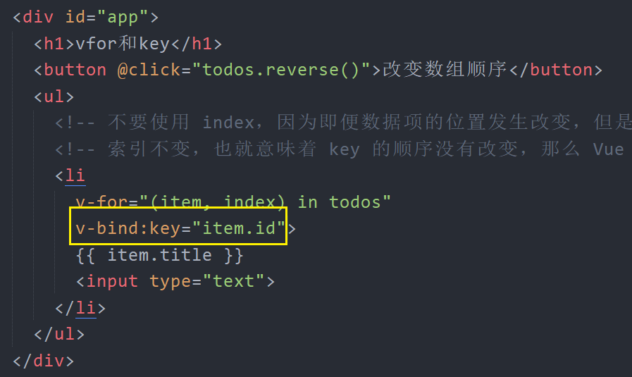
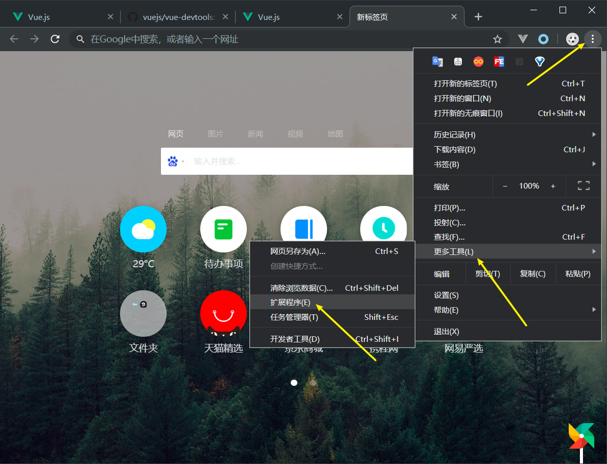
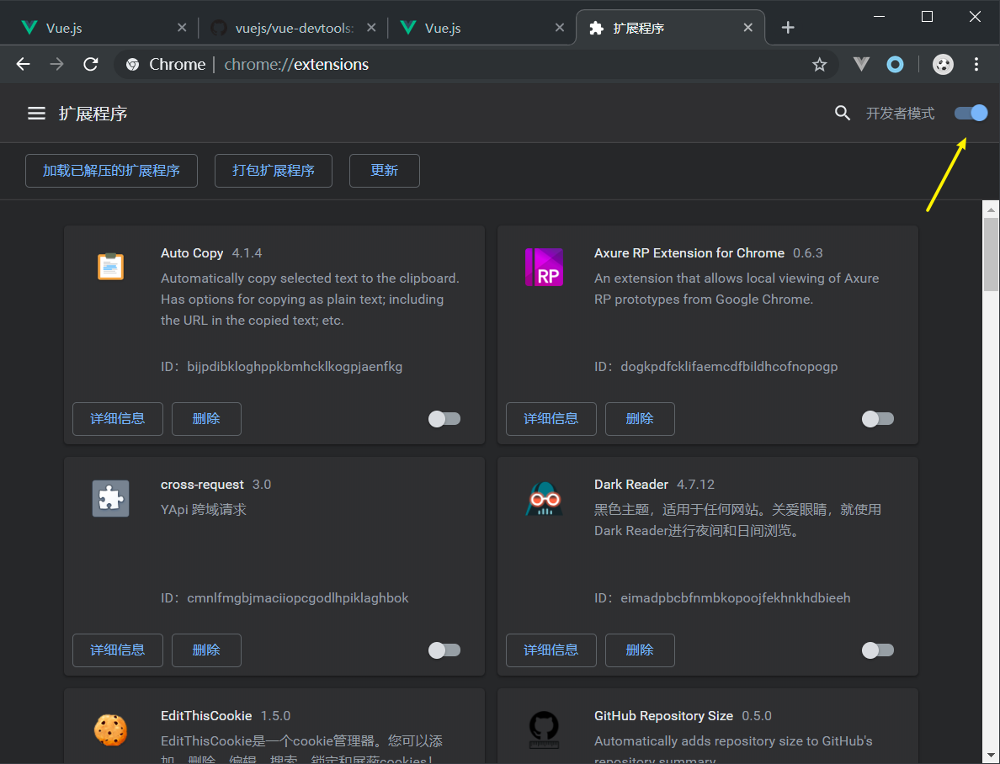
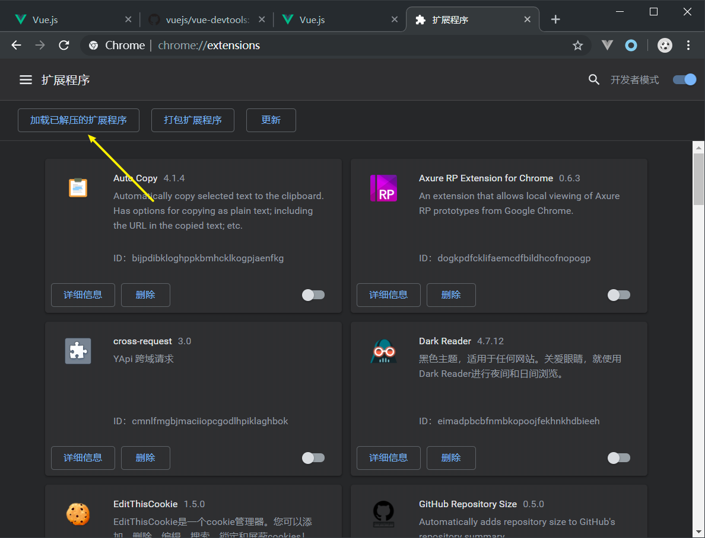
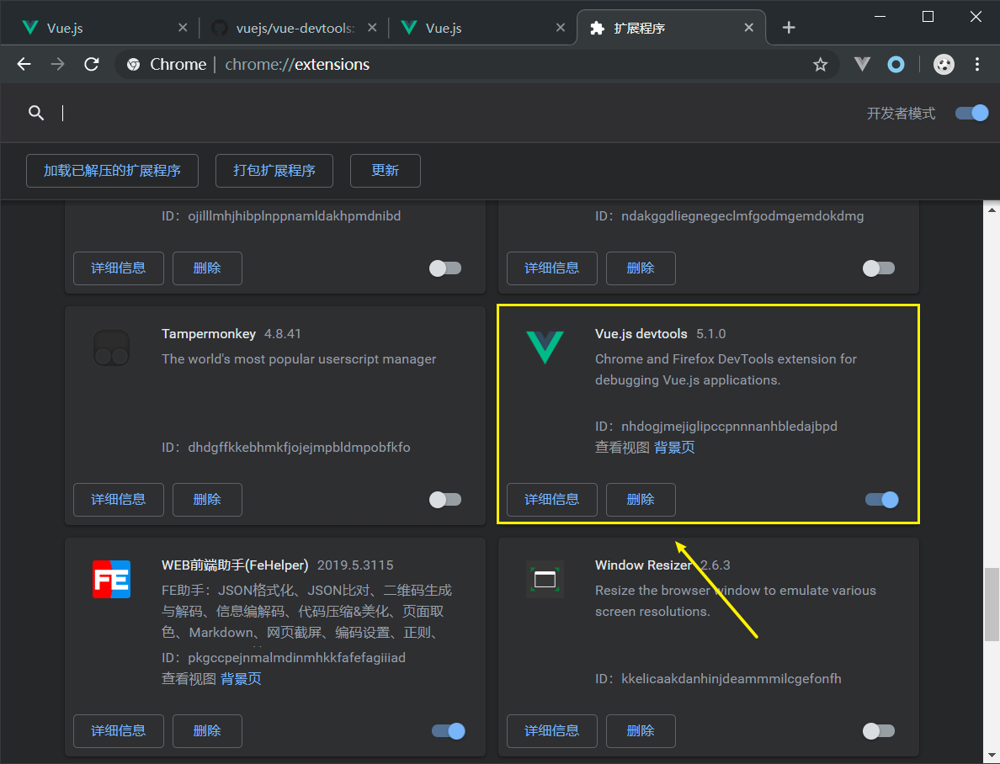
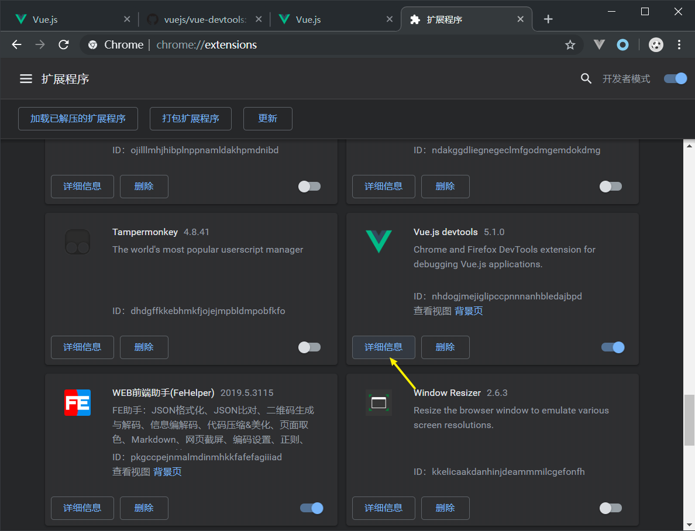
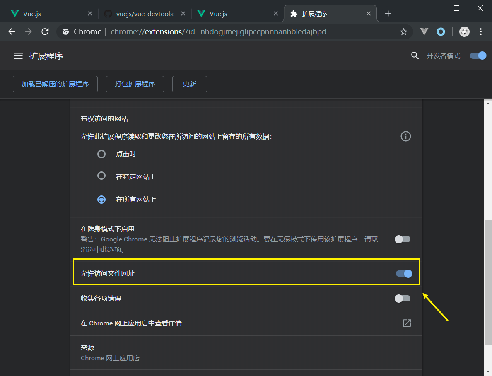
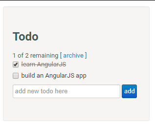

# 第 2 章 Vue 基础

---

## 安装

- Vue.js 不支持 IE8 及其以下版本
  - 因为 Vue 使用了 IE8 无法模拟的 ECMAScript 5 特性。但它支持所有兼容 ECMAScript 5 的浏览器。
- 最新稳定版本：2.6.10
  - 每个版本的更新日志见 [Github Releases](https://github.com/vuejs/vue/releases)
- 直接下载
  - 开发版本：`https://vuejs.org/js/vue.js`
  - 生产版本：`https://vuejs.org/js/vue.min.js`
- CDN
  - `<script src="https://cdn.jsdelivr.net/npm/vue"></script>` 最新稳定版
  - `<script src="https://cdn.jsdelivr.net/npm/vue@2.6.10/dist/vue.js"></script>` 指定版本
- 使用 `npm` 下载
  - `npm install vue` 最新稳定版
  - `npm install vue@版本号` 指定版本

```
我们建议你的项目如果使用了 npm ，则最好创建一个 package.json 文件，用来存储第三方包依赖信息。

当我需要把项目放到 Git 远程仓库的时候，没有必要放到 node_modules，如果我要分享给你，我只需要给你仓库地址就可以了。
你要去下载仓库，里面没有第三方包，你也无法运行示例代码？

怎么办？

这个时候，你就可以：

npm install
```

---

## 像使用模板引擎一样使用 Vue

需求：下面的数据如何显示到页面中？

```js
const data = {
  message: 'Hello Vue.js!',
  user: {
    name: '张三',
    age: 18,
    gender: 0
  },
  todos: ['吃饭', '睡觉', '打豆豆']
}
```

```html
<h1></h1>
<p>姓名：</p>
<p>年龄：</p>
<p>性别：</p>
<ul>
  <li></li>
</ul>
```

方式一：操作 DOM

方式二：模板引擎

```html
<div id="app"></div>

<scrit type="text/html" id="tpl">
  <h1>{{ message }}</h1>
  <p>姓名：{{ user.name }}</p>
  <p>年龄：</p>
  <p>性别：{{ user.gender === 0 ? '女' : '男' }}</p>
  <ul>
    {{ each }}
    <li>{{ $value }}</li>
    {{ /each }}
  </ul>
</scrit>

<script src="模板引擎.js"></script>
<script>
  var htmlStr = template('tpl', data)
  document.getElementById('app').innerHTML = htmlStr
</script>
```

方式三：使用 Vue

```html

```

## 数据驱动视图

提问？

如果我需要修改 `h1`、`用户名`、`年龄`、`todos列表` 视图。

方式一：操作 DOM

方式二：模板引擎

- 修改数据
- 重新调用编译渲染，然后把结果替换到容器中

方式三：Vue：数据驱动视图

## 实例选项 - el

- 不能是 html、body 节点
- el 只能作用到单一节点上

## 实例选项 - data

- 模板中访问的数据必须初始化到 data 中
- 模板无法访问 Vue 实例之外的数据
  - 除非你手动将外部数据添加为 data 数据成员了

```js
const a = 1
const c = 2

new Vue({
  el: '#app',
  data: {
    // a: a,
    // 等价于 a: a，ECMAScript 6 简写方式
    a,
    b: c
  }
})
```

## 模板语法 - 插值

### 文本

```html
<p>{{ message }}</p>
<span>{{ message }}</span>
<strong>{{ message }}</strong>
```

### JavaScript 表达式

```html
<p>{{ number + 1 }}</p>
<p>{{ number + 1 > 10 ? 'number大于10' : 'number小于10' }}</p>
<p>{{ arr }}</p>
<p>{{ message.split('').reverse().join('') }}</p>
```

### 属性

```html
<p v-bind:title="message">花括号不能使用在属性中</p>
<a v-bind:href="url">去百度</a>
```

可以简写

```html
<p :title="message">花括号不能使用在属性中</p>
<a :href="url">去百度</a>
```

属性值中的写法和 `{{}}` 中的写法一致，也是 JavaScript 表达式

```html
<p :title="message.split('').reverse().join('')">Hello World</p>
<p :title="1 + 1">属性中的表达式</p>
<p :title="number + 1 > 10 ? 'number大于10' : 'number小于10'">属性中的表达式</p>
```

### 原始 HTML 字符串

```html
<div>{{ htmlStr }}</div>
<!-- 使用 v-html 指令渲染 html 标签内容字符串 -->
<div v-html="htmlStr"></div>
```

> v-html 中绑定的 html 内容数据不能使用数据绑定

## 列表渲染

### 数组

- `v-for="item in todos"`
- `v-for="(item, index) in todos"`

### 数组的更新

数据中的数据的变化会触发视图更新。哪些数据修改操作会影响视图更新？

```js
push()
pop()
shift()
unshift()
splice()
sort()
reverse()
直接替换数组的方式，就是直接为数组进行重新赋值
```

注意：

1. 当你利用索引直接设置一个数组项时，例如：`vm.items[indexOfItem] = newValue`
   1. 通过索引为数组元素重新赋值不会触发视图更新
   2. 但是：`vm.toods[index].title = '哈哈哈'` 是可以的
   3. 正确方式：`Vue.set(数组, 索引, 数据)`
      1. `Vue` 是通过 `vue.js` 提供的全局构造函数
   4. 在实例中你可以 `vue实例.$set(数组, 索引, 数据)`
      1. `vue实例` 是你通过 `new Vue` 得到的实例对象
2. 当你修改数组的长度时，例如：`vm.items.length = newLength`

```js
var obj = {
  a: 1,
  b: 2
}

// 重新赋值
obj = xxx

// 修改
obj.a = 3
```

### v-if 和 key

例如我有这样一段代码：

```vue
<!DOCTYPE html>
<html lang="en">

<head>
  <meta charset="UTF-8">
  <title>vfor和key</title>
  <style></style>
  <!--  -->
</head>

<body>
  <div id="app">
    <h1>vfor和key</h1>
    <button @click="todos.reverse()">改变数组顺序</button>
    <ul>
      <!-- 不要使用 index，因为即便数据项的位置发生改变，但是索引不会变 -->
      <!-- 索引不变，也就意味着 key 的顺序没有改变，那么 Vue 就不会处理 -->
      <li
        v-for="(item, index) in todos">
        {{ item.title }}
        <input type="text">
      </li>
    </ul>
  </div>
  <script src="https://cdn.jsdelivr.net/npm/vue@2.6.10/dist/vue.js"></script>
  <script>
    const app = new Vue({
      el: '#app',
      data: {
        todos: [
          { id: 1, title: '吃饭' },
          { id: 2, title: '睡觉' },
          { id: 3, title: '打豆豆' }
        ]
      },
      methods: {
      }
    })
  </script>
</body>

</html>

```

效果如下：



修改代码如下：



结果演示：


总结：

> 官方文档说明：[https://cn.vuejs.org/v2/guide/list.html#%E7%BB%B4%E6%8A%A4%E7%8A%B6%E6%80%81](https://cn.vuejs.org/v2/guide/list.html#维护状态)

当 Vue 正在更新使用 `v-for` 渲染的元素列表时，它默认使用“就地更新”的策略。如果数据项的顺序被改变，Vue 将不会移动 DOM 元素来匹配数据项的顺序，而是就地更新每个元素，并且确保它们在每个索引位置正确渲染。这个类似 Vue 1.x 的 `track-by="$index"`。

这个默认的模式是高效的，但是**只适用于不依赖子组件状态或临时 DOM 状态 (例如：表单输入值) 的列表渲染输出**。

为了给 Vue 一个提示，以便它能跟踪每个节点的身份，从而重用和重新排序现有元素，你需要为每项提供一个唯一 `key` 属性：

```
<div v-for="item in items" v-bind:key="item.id">
  <!-- 内容 -->
</div>
```

建议尽可能在使用 `v-for` 时提供 `key` attribute，除非遍历输出的 DOM 内容非常简单，或者是刻意依赖默认行为以获取性能上的提升。

因为它是 Vue 识别节点的一个通用机制，`key` 并不仅与 `v-for` 特别关联。后面我们将在指南中看到，它还具有其它用途。

> 注意：
>
> - 不要使用对象或数组之类的非基本类型值作为 `v-for` 的 `key`。请用字符串或数值类型的值。
> - 不要使用遍历索引 index 作为唯一的 key 值
> - 一般使用数据中的 id 作为唯一值

### 对象

- `v-for="value in 对象"`
- `v-for="(value, key) in 对象"`

### 对象的更新

- 对象.属性 = 数据
- 对象 = 数据

注意：

- 不能通过 `对象.xxx = xxx` 为对象添加一个未初始化的成员
- 解决方式：
  - `Vue.set(对象, '属性名', 属性值)`
  - 也可以 `vue实例.$set(对象, 属性名, 属性值)`
- 建议做法：尽量把你需要的数据都一次性初始化好，哪怕这个数据默认为空

### 值范围遍历

- `v-for="n in 10"`

## 条件渲染

### v-if

### v-else、v-else-if

### v-show

### v-if 和 v-show 区别

- v-if
  - true 渲染 DOM
  - false 不渲染 DOM
- v-show
  - true 渲染 DOM
  - false 渲染 DOM，不显示（display: none）
  - 不能和 v-else、v-else-if 结合使用

> 一般来说，`v-if` 有更高的切换开销，而 `v-show` 有更高的初始渲染开销。因此，如果需要非常频繁地切换，则使用 `v-show` 较好；如果在运行时条件很少改变，则使用 `v-if` 较好。

### v-if 和 template

## 事件处理

### 基本语法

### 函数简写

### 指令简写

- @事件类型

### 默认参数

- event 事件对象

### 自定义传参

```
v-on="函数(参数)"

v-on="函数(参数, $event)"
```


## 表单输入绑定

## 样式处理

## Vue [**DevTools**]()

- 官网：<https://github.com/vuejs/vue-devtools>

### 下载安装

- 方式一：[Get the Chrome Extension](https://chrome.google.com/webstore/detail/vuejs-devtools/nhdogjmejiglipccpnnnanhbledajbpd)
- 方式二：手动下载安装

下面是手动下载的方式：

1. 下载并编译生成安装文件

```bash
# 下载到任何位置都可以
$ git clone https://github.com/vuejs/vue-devtools.git

# 进入下载的目录中
$ cd vue-devtools

# 安装依赖
$ npm install

# 构建扩展包
# 它会将离线安装文件生成到 vue-devtools/shells/chrome 中
$ npm run build
```

2. 安装 Chrome 扩展管理



> 右上角自定义及控制 Chrome -> 更多工具 -> 扩展程序



> 启动开发者模式



> 选择加载已解压的扩展程序
>
> 在弹出来的文件选择加载 `vue-devtools/shell/chrome`



> 然后在你的扩展列表中就看到了 Vue.js devtools 已经安装进来了

3. 配置 Vue DevTools



> 选择 详细信息



> 在插件详细信息中找到 “允许访问文件网址” 并启用

### 使用

---

## 课堂练习

以下是几个小练习，用来辅助大家增强体会 Vue 的数据驱动视图思想（MVVM）：

- 姓名展示：两个文本框，让用户分别输入性和名，然后将数据实时展示到界面上
- 数字自动增长：一个文本框用来呈递数字，一个按钮，用户点击按钮，文本框中的数字+1
- 购物车计价器：有商品价格，和商品数量，用户可以点击加减按钮改变商品数量，将价格实时展示到界面上
- 数字计算器：实现加法计算器
- 数字计算器：实现加减乘除

以上所有练习，都不要着急写代码，不要用以前 DOM 的思想去操作，
利用 Vue 的数据驱动视图的思想，去考虑问题：

- 根据视图抽象数据模型
  - 数据
  - 行为
- 数据改变，触发视图更新

---

## 综合案例：`Todo List`



- 任务列表展示
- 添加任务
- 切换任务完成状态
- 删除单个任务
- 删除所有已完成任务
- 显示所有任务数量
- 显示所有未完成任务数

---

## 使用总结

- Vue 最大程度上减少了页面上的 DOM 操作
- 让开发人员更专注于业务操作
- 通过简洁的指令结合页面结构与逻辑数据
- 通过组件化方便模板重用以及增加可维护性
- 代码结构更合理
- 维护成本更低
- **VueJS 解放了传统 JavaScript 中繁琐的 DOM 操作**
