# 第 3 章 基础案例

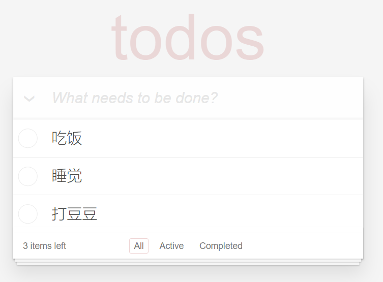

> 学习目标：
>
> - 掌握 Vue.js 基础语法

案例基本会涵盖到以下内容知识点：

- 数据绑定
- 计算属性 computed
- 侦听器 watch
- Class 与 Style 样式处理
- 条件渲染
- 列表渲染
- 事件处理
- 表单输入双向数据绑定
- 组件...

## 案例介绍

- [TodoMVC 官网](http://todomvc.com/)
- [TodoMVC 模板](https://github.com/tastejs/todomvc-app-template)

---

## 需求说明

- [TodoMVC 需求说明](https://github.com/tastejs/todomvc/blob/master/app-spec.md)
- [脑图整理的需求说明](http://naotu.baidu.com/file/b935b732b2dbf1b2ff12a3291d7f24e5?token=f1973a115e68f4e1)

- [ ] 列表展示
  - [ ] 有数据渲染内容区域
  - [ ] 无数据隐藏内容区域
- [ ] 添加任务
- [ ] 删除任务
- [ ] 任务项
  - [ ] 切换单个任务项的完成状态
  - [ ] 任务项的完成状态样式
- [ ] 切换所有任务的完成状态
- [ ] 显式剩余任务数量
- [ ] 清除所有已完成任务项

---

## 初始化

### 下载模板

```bash
$ git clone https://github.com/tastejs/todomvc-app-template.git

# 切换到 todomvc-vue 目录中，安装依赖项
cd todomvc-vue

# 安装依赖
npm install

# 安装完成，打开 index.html 预览模板。
```

### 导入 Vue

1. 安装 Vue 到项目中

```bash
$ npm i vue
```

2. 在页面中引入 vue.js 脚本文件

3. 在 `js/app.js` 中

```js
new Vue({
  el: '#app',
  data: {
    foo: 'bar'
  },
  methods: {}
})
```

## 任务列表

```html
<li class="completed" v-for="item in todos">
  <div class="view">
    <input class="toggle" type="checkbox" checked />
    <label>{{ item.title }}</label>
    <button class="destroy"></button>
  </div>
  <input class="edit" value="Create a TodoMVC template" />
</li>
```

状态处理

```html
<li :class="{ completed: item.completed }" v-for="item in todos">
  <div class="view">
    <input class="toggle" type="checkbox" v-model="item.completed" />
    <label>{{ item.title }}</label>
    <button class="destroy"></button>
  </div>
  <input class="edit" value="Create a TodoMVC template" />
</li>
```

没有数据的时候隐藏内容区域

```html
<template v-if="todos.length > 0">
  <!-- This section should be hidden by default and shown when there are todos -->
  <section class="main">
    <input id="toggle-all" class="toggle-all" type="checkbox" />
    <label for="toggle-all">Mark all as complete</label>
    <ul class="todo-list">
      <!-- These are here just to show the structure of the list items -->
      <!-- List items should get the class `editing` when editing and `completed` when marked as completed -->
      <!--
              任务项
                completed 已完成
                editing 编辑中
                空     未完成
             -->

      <li :class="{ completed: item.completed }" v-for="item in todos">
        <div class="view">
          <input class="toggle" type="checkbox" v-model="item.completed" />
          <label>{{ item.title }}</label>
          <button class="destroy"></button>
        </div>
        <input class="edit" value="Create a TodoMVC template" />
      </li>
      <!-- <li>
              <div class="view">
                <input class="toggle" type="checkbox">
                <label>Buy a unicorn</label>
                <button class="destroy"></button>
              </div>
              <input class="edit" value="Rule the web">
            </li> -->
    </ul>
  </section>
  <!-- This footer should hidden by default and shown when there are todos -->
  <footer class="footer">
    <!-- This should be `0 items left` by default -->
    <span class="todo-count"><strong>0</strong> item left</span>
    <!-- Remove this if you don't implement routing -->
    <ul class="filters">
      <li>
        <a class="selected" href="#/">All</a>
      </li>
      <li>
        <a href="#/active">Active</a>
      </li>
      <li>
        <a href="#/completed">Completed</a>
      </li>
    </ul>
    <!-- Hidden if no completed items are left ↓ -->
    <button class="clear-completed">Clear completed</button>
  </footer>
</template>
```

```html {2,15}
...
<template v-if="todos.length > 0">
  <section class="main">
    <input
      id="toggle-all"
      class="toggle-all"
      type="checkbox"
      v-bind:checked="getToggleAllStatus()"
      @change="handleToggleAll"
    />
    <label for="toggle-all">Mark all as complete</label>
    <ul class="todo-list">
      <!-- These are here just to show the structure of the list items -->
      <!-- List items should get the class `editing` when editing and `completed` when marked as completed -->
      <li v-for="(item, index) in todos" v-bind:class="{completed: item.done}">
        <div class="view">
          <input class="toggle" type="checkbox" v-model="item.done" />
          <label>{{ item.title }}</label>
          <button @click="handleRemoveTodo(index)" class="destroy"></button>
        </div>
        <input class="edit" value="Rule the web" />
      </li>
    </ul>
  </section>
  <!-- This footer should hidden by default and shown when there are todos -->
  <footer class="footer">
    <!-- This should be `0 items left` by default -->
    <span class="todo-count"><strong>0</strong> item left</span>
    <!-- Remove this if you don't implement routing -->
    <ul class="filters">
      <li>
        <a class="selected" href="#/">All</a>
      </li>
      <li>
        <a href="#/active">Active</a>
      </li>
      <li>
        <a href="#/completed">Completed</a>
      </li>
    </ul>
    <!-- Hidden if no completed items are left ↓ -->
    <button class="clear-completed">Clear completed</button>
  </footer>
</template>
...
```

## 添加任务

HTML：

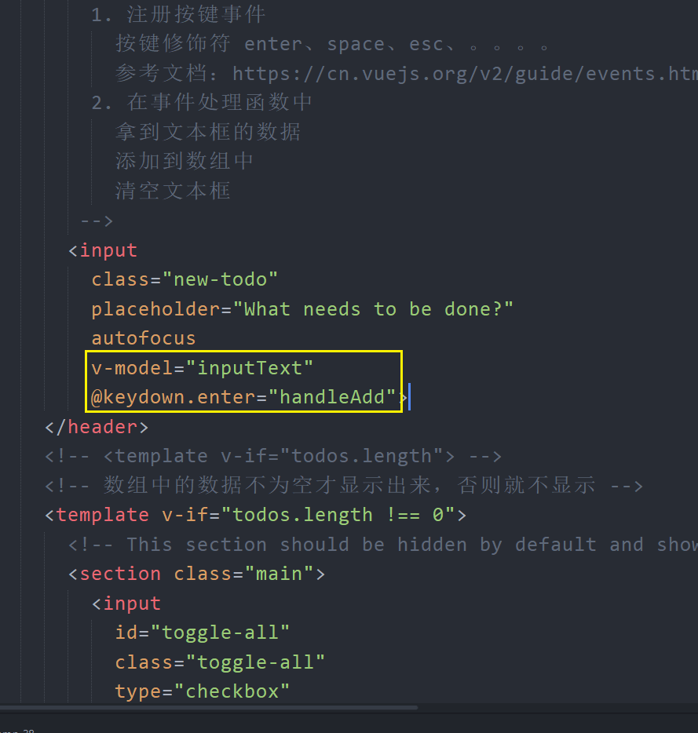

JavaScript：

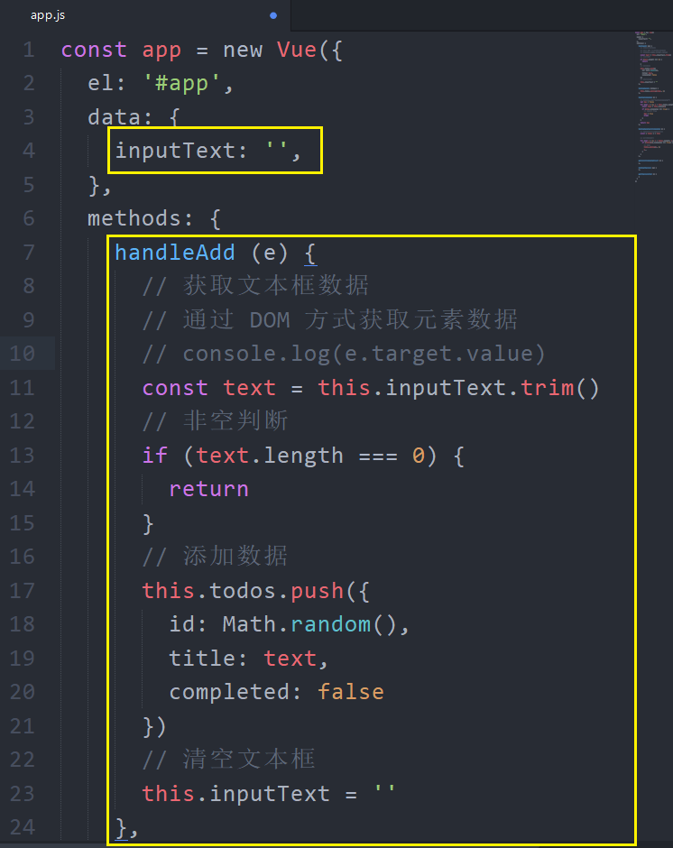

## 切换所有任务的完成状态

```html {6,7}
...
<input
  id="toggle-all"
  class="toggle-all"
  type="checkbox"
  v-bind:checked="getToggleAllStatus()"
  @change="handleToggleAll"
/>
...
```

```javascript {4,11}
...
methods: {
  ...
  handleToggleAll (e) {
    const checked = e.target.checked
    this.todos.forEach((item) => {
      item.done = checked
    })
  },

  getToggleAllStatus () {
    let status = true
    this.todos.forEach(item => {
      if (item.done === false) {
        status = false
      }
    })
    return status
  },
  ...
}
...
```

## 删除单个任务

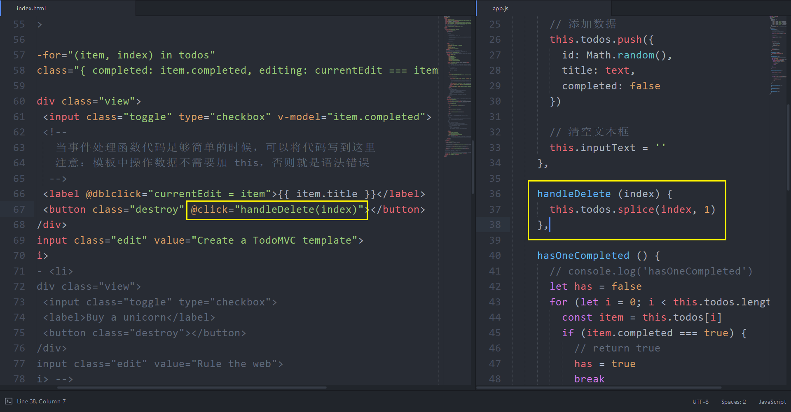

## 删除所有已完成任务

### 处理显示状态

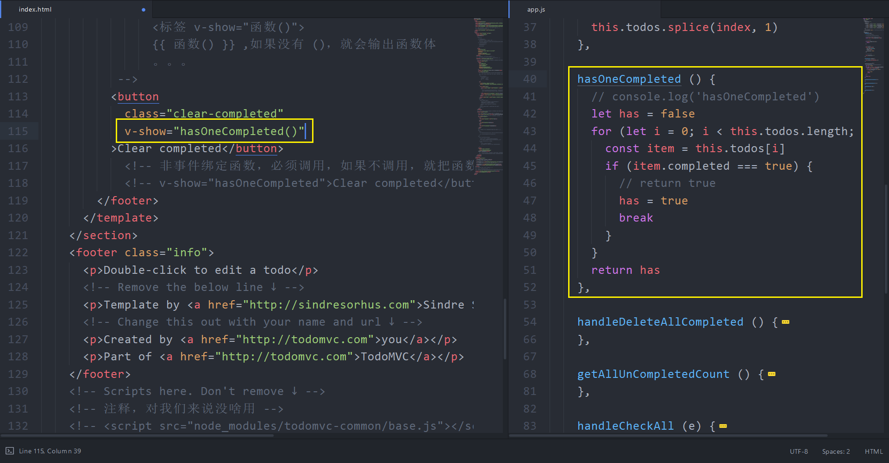

### 删除

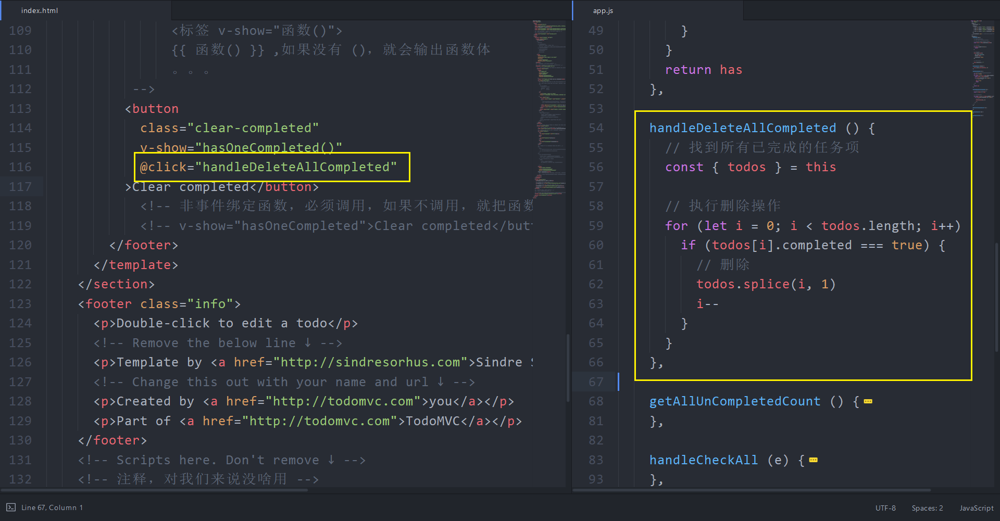

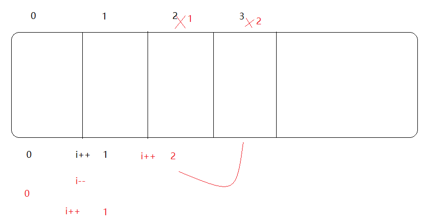

## 显示所有剩余未完成任务数

JavaScript：

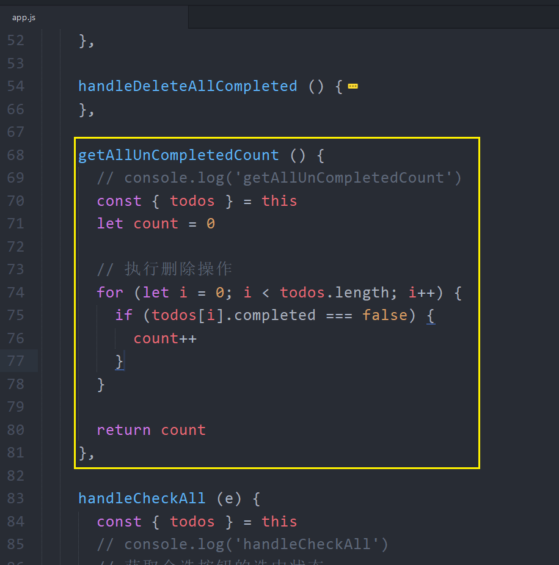

HTML：

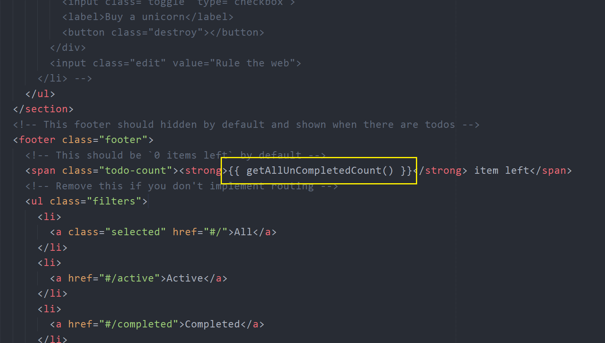

## 编辑任务

### 双击获得编辑状态

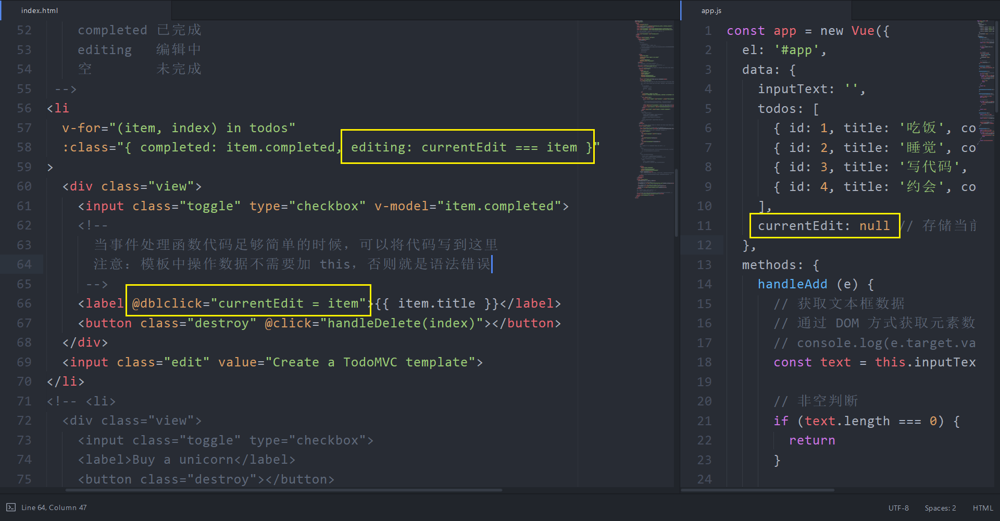

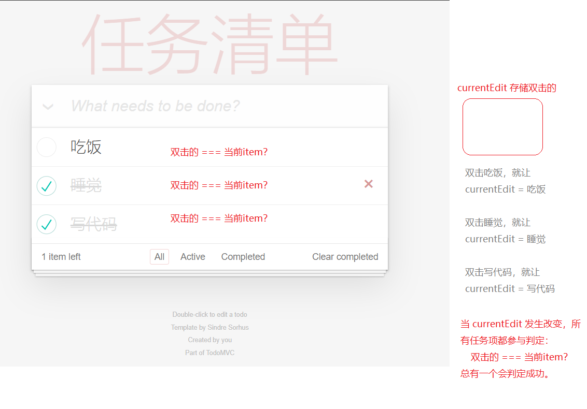

### 完成编辑


## 数据过滤（自行参考源码学习）

## 持久化存储（自行参考源码学习）

## 优化

### 使用 vcloak 解决表达式闪烁

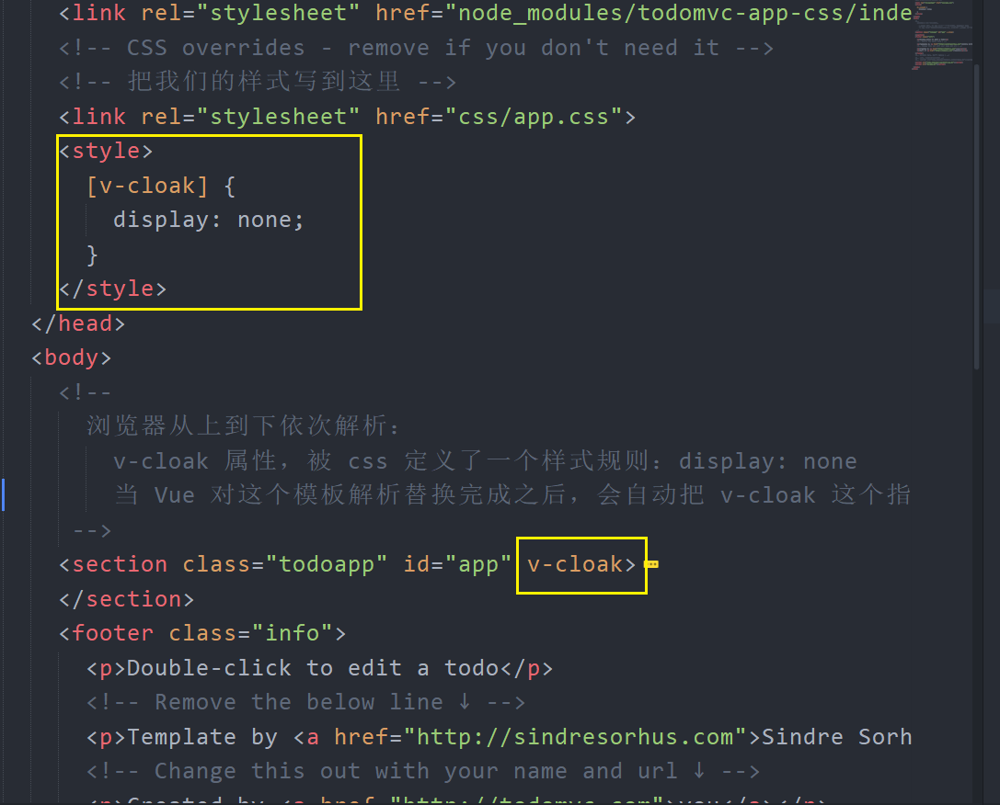
