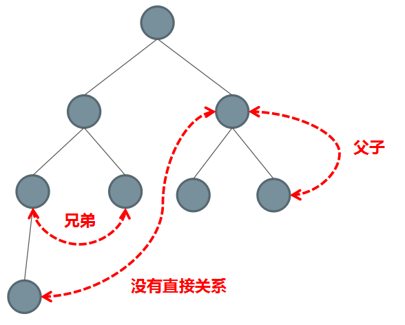

# 第 5 章 组件基础

> 学习目标
>
> - 了解组件的概念
> - 掌握组件的定义
> - 了解组件的组织方式
> - 掌握组件通信

组件 (Component) 是 Vue.js 最强大的功能之一。组件可以扩展 HTML 元素，封装可重用的代码。


## 通过 Element 感受组件

[Element](https://element.eleme.cn/#/zh-CN) 是饿了么前端团队基于 Vue 开发的一个知名的第三方组件库，它能帮助我们更加快速的构建应用。


体验：

```html
<!DOCTYPE html>
<html lang="en">

<head>
  <meta charset="UTF-8">
  <title>感受组件的威力</title>
  <style></style>
  <!-- 引入组件库样式 -->
  <link rel="stylesheet" href="https://unpkg.com/element-ui/lib/theme-chalk/index.css">
</head>

<body>
  <div id="app">
    <h1>感受组件的威力</h1>
    <h2>Button 按钮</h2>
    <el-button>默认按钮</el-button>
    <el-button type="primary">主要按钮</el-button>
    <el-button type="success">成功按钮</el-button>
    <el-button type="info">信息按钮</el-button>
    <el-button type="warning">警告按钮</el-button>
    <el-button type="danger">危险按钮</el-button>
    <h2>文本框</h2>
    <el-input v-model="input" placeholder="请输入内容" clearable></el-input>
    <el-input-number
      v-model="num"
      :min="1"
      :max="10"
      label="描述文字"></el-input-number>
    <h2>日期选择器</h2>
    <el-date-picker
      v-model="value1"
      type="date"
      placeholder="选择日期">
    </el-date-picker>
  </div>
  
  <!-- 引入 VUe.js -->
  <script src="https://cdn.jsdelivr.net/npm/vue@2.6.10/dist/vue.js"></script>
  <!-- 引入组件库 -->
  <script src="https://unpkg.com/element-ui/lib/index.js"></script>
  <script>
    const app = new Vue({
      el: '#app',
      data: {
        input: '',
        num: 1,
        value1: ''
      },
      methods: {}
    })
  </script>
</body>

</html>

```

体验总结：

- 组件就是对局部视图的封装（HTML、CSS、JavaScript）；从使用角度，组件就是一个自定义标签
- 开发效率高
  - 每个组件的代码都是独立的，不会因为所有代码都混在一起查找麻烦而导致开发效率低下
  - 简单易用，快速完成任务
  - 便于团队分工协作
- 可维护性高
  - 哪里有问题，就找哪个组件
- 可重用性好

> 组件化开发不是 Vue 独创，早期的 Angular 在自定义指令中有了一点组件化的概念，但还不够彻底，直到 React 的诞生，一种完全基于组件化开发方式的前端框架。随后 Angular 等其它框架都纷纷效仿提供了组件化的开发模式，Vue 的诞生也是吸取了 Angular 和 React 等其他框架的一些核心概念，所以从诞生之初就具有组件化的开发支持。
>
> 目前主流框架的开发模式都是组件化开发。

## 基本语法

### 示例

定义一个名为 button-counter 的组件：

```js
Vue.component('button-counter', {
  data: function () {
    return {
      count: 0
    }
  },
  template: '<button v-on:click="count++">You clicked me {{ count }} times.</button>'
})
```

组件是可复用的 Vue 实例，且带有一个名字：在这个例子中是 `<button-counter>`。我们可以在一个通过 `new Vue` 创建的 Vue 根实例中，把这个组件作为自定义元素来使用：

```html
<div id="app">
  <button-counter></button-counter>
</div>
```

```js
new Vue({ el: '#app' })
```

<p class="codepen" data-height="265" data-theme-id="dark" data-default-tab="js,result" data-user="lipengzhou" data-slug-hash="ZdWOep" style="height: 265px; box-sizing: border-box; display: flex; align-items: center; justify-content: center; border: 2px solid; margin: 1em 0; padding: 1em;" data-pen-title="组件示例">
  <span>See the Pen <a href="https://codepen.io/lipengzhou/pen/ZdWOep/">
  组件示例</a> by LPZ (<a href="https://codepen.io/lipengzhou">@lipengzhou</a>)
  on <a href="https://codepen.io">CodePen</a>.</span>
</p>
<script async src="https://static.codepen.io/assets/embed/ei.js"></script>

组件是可复用的 Vue 实例，所以它们与 `new Vue` 接收相同的选项，例如 `data`、`computed`、`watch`、`methods` 以及生命周期钩子等。仅有的例外是像 `el` 这样根实例特有的选项。

### 组件的复用

你可以将组件进行任意次数的复用：

```html
<div id="components-demo">
  <button-counter></button-counter>
  <button-counter></button-counter>
  <button-counter></button-counter>
</div>
```

注意当点击按钮时，每个组件都会各自独立维护它的 `count`。因为你每用一次组件，就会有一个它的新**实例**被创建。

### 组件的 `data` 必须是函数

当我们定义这个 `<button-counter>` 组件时，你可能会发现它的 `data` 并不是像这样直接提供一个对象：

```js
data: {
  count: 0
}
```

取而代之的是，**一个组件的 data 选项必须是一个函数**，因此每个实例可以维护一份被返回对象的独立的拷贝：

```js
data: function () {
  return {
    count: 0
  }
}
```

如果 Vue 没有这条规则，点击一个按钮就可能会像如下代码一样影响到*其它所有实例*：

<p class="codepen" data-height="265" data-theme-id="dark" data-default-tab="js,result" data-user="lipengzhou" data-slug-hash="wLGGxY" style="height: 265px; box-sizing: border-box; display: flex; align-items: center; justify-content: center; border: 2px solid; margin: 1em 0; padding: 1em;" data-pen-title="wLGGxY">
  <span>See the Pen <a href="https://codepen.io/lipengzhou/pen/wLGGxY/">
  wLGGxY</a> by LPZ (<a href="https://codepen.io/lipengzhou">@lipengzhou</a>)
  on <a href="https://codepen.io">CodePen</a>.</span>
</p>
<script async src="https://static.codepen.io/assets/embed/ei.js"></script>

### 私有作用域

- 内部无法访问外部
- 外部无法访问内部

### 组件注册方式

组件的注册方式有两种方式

- 全局组件
  - 定义在全局，在任意组件中都可以直接使用
- 局部组件
  - 定义在组件内部，只能在当前组件使用

建议把通用的组件定义在全局，把不通用的组件定义在局部。

#### 全局注册

注册：

```js
Vue.component('my-component', {
  template: '<div>A custom component!</div>'
});

// 创建根实例
new Vue({
  el: '#example'
});
```

在模板中使用组件：

```html
<div id="example">
  <my-component></my-component>
</div>
```

渲染结果：

```html
<div id="example">
  <div>A custom component!</div>
</div>
```

> 总结：
>
> - 可以在任何组件中被使用的组件（就好比全局变量）
> - 如果应用中把所有组件都定义成全局组件，名字就不能冲突
> - 使用场景：多个页面都需要使用的组件建议定义成全局

#### 局部注册

你不必把每个组件都注册到全局。你可以通过某个 Vue 实例/组件的实例选项 `components` 注册仅在其作用域中可用的组件：

注册：

```javascript
new Vue({
  // ...
  components: {
    // <my-component> 将只在父组件模板中可用
    'my-component': {
      template: '<div>A custom component!</div>'
    }
  }
})
```

使用：

```
<div id="example">
  <div>A custom component!</div>
  <my-component></my-component>
</div>
```

总结：

- 只能在它的父组件(定义所属的组件)中被使用，不会污染全局（就好比函数内定义的变量）

- 使用组件的时候，会先在自己的 components 中找，如果找不到，**直奔** 全局找

- 局部组件 **只能** 在父组件中被使用，爷爷、后代。。。都不行

- 使用场景：不需要在其它组件中被使用的组件建议定义成局部

#### 小结


---

### 组件的模板

组件的 `tempalte` 支持以下三种使用方式：

- 字符串(例如：`template: '…'`)
- .vue 单文件组件中的 `template` 模板
- script 标签模板(了解)


#### 字符串

```js
Vue.component('hello-world', {
  template: `<p>Hello World!</p>`
})
```


#### .vue 单文件

```html
<!-- 组件的模板 -->
<template>
  <div class="count-box">
    <p>{{ count }}</p>
    <button @click="handleIncrement">点击+1</button>
  </div>  
</template>

<!-- 组件的行为 -->
<script>
  export default {
    data () {
      return {
        count: 0
      }
    },
    methods: {
      handleIncrement () {
        this.count++
      }
    }
  }
</script>

<!-- 组件的样式 -->
<style>
.count-box {
  padding: 5px;
  border: 1px solid #000;
}
</style>

```

> 注意：该文件无法直接运行在浏览器中，需要使用 webpack 或 Vue 官方提供的 VueCLI 等构建工具将其编译打包才可以运行到浏览器中。

#### script 标签模板（了解即可）

```html
<script type="text/x-template" id="xxx">
	模板字符串
</script>
```

```js
Vue.component('组件名字', {
  template: '#xxx' // script 标签id
})
```


#### 小结

- 字符串模板
  - 优点：适合快速学习测试，方便快捷
  - 缺点：编辑器无法提供高亮显示、智能提示等功能
- .vue 单文件组件
  - 优点：更好的语法高亮、智能提示等功能
  - 缺点：需要配合打包工具使用
- script 标签模板（了解）

> 总结：
>
> - 学习测试使用字符串模板就可以了
> - 真正做项目当然是 .vue 单文件组件了
> - script 标签模板了解即可


---

## 组件通信

组件就像零散的积木，我们需要把这些积木按照一定的规则拼装起来，而且要让它们互相之间能进行通讯，这样才能构成一个有机的完整系统。

在真实的应用中，组件最终会构成树形结构，就像人类社会中的家族树一样：



在树形结构里面，组件之间有几种典型的关系：父子关系、兄弟关系、没有直接关系。

相应地，组件之间有以下几种典型的通讯方案：

- 直接的父子关系
  - 父组件通过 `this.$refs` 访问子组件
  - 子组件 `this.$parent` 访问其父组件
- 直接父子关系
  - 父组件通过 Props 给子组件下发数据
  - 子组件通过事件方式给父组件发送消息
- 没有直接关系
  - 简单场景：借助于事件机制进行通讯
  - 复杂场景：使用状态管理容器（例如 Vue 生态中的 Vuex、React 生态中的 Redux、Mobx 等）
- 利用 cookie 和 localstorage 进行通讯
- 利用 session 进行通讯

无论你使用什么前端框架，组件之间的通讯都离开不以上几种方案，这些方案与具体框架无关。

## 父子组件通信

组件设计初衷就是要配合使用的，最常见的就是形成父子组件的关系：组件 A 在它的模板中使用了组件 B。它们之间必然需要相互通信：父组件可能要给子组件下发数据，子组件则可能要将它内部发生的事情告知父组件。然而，通过一个良好定义的接口来尽可能将父子组件解耦也是很重要的。这保证了每个组件的代码可以在相对隔离的环境中书写和理解，从而提高了其可维护性和复用性。
在 Vue 中，父子组件的关系可以总结为 prop 向下传递，事件向上传递。父组件通过 prop 给子组件下发数据，子组件通过事件给父组件发送消息。看看它们是怎么工作的。


### 父传子(Props Down)

**1. 在父组件中通过子组件标签属性传递数据**

```html
<child message="hello!"></child>
```

**2. 在子组件显式地用 `props` 选项声明它预期的数据并使用**

```js
Vue.component('child', {
  // 必须显式的声明接收 props
  props: ['message'],
  // 就像 data 一样，prop 也可以在模板中使用
  // 同样也可以在 vm 实例中通过 this.message 来使用
  template: '<span>{{ message }}</span>'
});
```

#### camelCase vs. kebab-case

HTML 特性是不区分大小写的。所以，当使用的不是字符串模板时，camelCase (驼峰式命名) 的 prop 需要转换为相对应的 kebab-case (短横线分隔式命名)。

```js
Vue.component('child', {
  // 在 JavaScript 中使用 camelCase
  props: ['myMessage'],
  template: '<span>{{ myMessage }}</span>'
});
```

```html
<!-- 在 HTML 中使用 kebab-case -->
<child my-message="hello!"></child>
```

如果你使用字符串模板，则没有这些限制。

#### 动态 Prop

与绑定到任何普通的 HTML 特性相类似，我们可以用 `v-bind` 来动态地将 `prop` 绑定到父组件的数据。每当父组件的数据变化时，该变化也会传导给子组件：

```html
<div>
  <input v-model="parentMsg">
  <br>
  <child v-bind:my-message="parentMsg"></child>
</div>
```

你也可以使用 v-bind 的缩写语法：

```html
<child :my-message="parentMsg"></child>
```

#### 字面量语法 vs 动态语法

初学者常犯的一个错误是使用字面量语法传递数值：

```html
<!-- 传递了一个字符串 "1" -->
<comp some-prop="1"></comp>
```

因为它是一个字面量 prop，它的值是字符串 "1" 而不是一个数值。如果想传递一个真正的 JavaScript 数值，则需要使用 v-bind，从而让它的值被当作 JavaScript 表达式计算：

```html
<!-- 传递真正的数值 -->
<comp v-bind:some-prop="1"></comp>
```

#### 单向数据流

Prop 是单向绑定的：当父组件的属性变化时，将传导给子组件，但是反过来不会。这是为了防止子组件无意间修改了父组件的状态，来避免应用的数据流变得难以理解。

另外，每次父组件更新时，子组件的所有 prop 都会更新为最新值。这意味着你不应该在子组件内部改变 prop。如果你这么做了，Vue 会在控制台给出警告。

在两种情况下，我们很容易忍不住想去修改 prop 中数据：

1. Prop 作为初始值传入后，子组件想把它当作局部数据来用
2. Prop 作为原始数据传入，由子组件处理成其它数据输出

对这两种情况，正确的应对方式是：

**1. 定义一个局部变量，并用 prop 的值初始化它：**

```js
props: ['initialCounter'],
data: function () {
  // var a = 1
  // var b = a
  // a = 123
  // b ?
  // b 456
  // a ?
  return { counter: this.initialCounter }
}
```

**2. 定义一个计算属性，处理 prop 的值并返回：**

```js
// ...
props: ['size'],
computed: {
  normalizedSize: function () {
    return this.size.trim().toLowerCase()
  }
},
```

> 注意在 JavaScript 中对象和数组是引用类型，指向同一个内存空间，如果 prop 是一个对象或数组，在子组件内部改变它会影响父组件的状态。即便引用类型可以，也不要利用这个特性，记住一个原则：组件的数据状态在组件内部管理维护，不要在其他位置去修改它。

#### Prop 验证

我们可以为组件的 prop 指定验证规则。如果传入的数据不符合要求，Vue 会发出警告。这对于开发给他人使用的组件非常有用。
要指定验证规则，需要用对象的形式来定义 prop，而不能用字符串数组：

```js
Vue.component('example', {
  props: {
    // 基础类型检测 (`null` 指允许任何类型)
    propA: Number,
    // 可能是多种类型
    propB: [String, Number],
    // 必传且是字符串
    propC: {
      type: String,
      required: true
    },
    // 数值且有默认值
    propD: {
      type: Number,
      default: 100
    },
    // 数组/对象的默认值应当由一个工厂函数返回
    propE: {
      type: Object,
      default: function () {
        return { message: 'hello' }
      }
    },
    // 自定义验证函数
    propF: {
      validator: function (value) {
        return value > 10
      }
    }
  }
});
```

`type` 可以是下面原生构造器：

- String
- Number
- Boolean
- Function
- Object
- Array
- Symbol

type 也可以是一个自定义构造器函数，使用 instanceof 检测。

当 prop 验证失败，Vue 会抛出警告 (如果使用的是开发版本)。
注意 prop 会在组件实例创建之前进行校验，所以在 default 或 validator 函数里，诸如 data、computed 或 methods 等实例属性还无法使用。

---

### 子传父(Events Up)

我们知道，父组件使用 prop 传递数据给子组件。但子组件怎么跟父组件通信呢？这个时候 Vue 的自定义事件系统就派得上用场了。

**1. 在子组件中调用 `$emit()` 方法发布一个事件**

```js
Vue.component('button-counter', {
  template: '<button v-on:click="incrementCounter">{{ counter }}</button>',
  data: function () {
    return {
      counter: 0
    }
  },
  methods: {
    incrementCounter: function () {
      this.counter += 1
      // 发布一个名字叫 increment 的事件
      this.$emit('increment')
    }
  },
});
```

**2. 在父组件中提供一个子组件内部发布的事件处理函数**

```js
new Vue({
  el: '#counter-event-example',
  data: {
    total: 0
  },
  methods: {
    incrementTotal: function () {
      this.total += 1
    }
  }
});
```

**3. 在使用子组件的模板的标签上订阅子组件内部发布的事件**

```html
<div id="counter-event-example">
  <p>{{ total }}</p>
  <!--
    订阅子组件内部发布的 increment 事件
    当子组件内部 $commit('increment') 发布的时候，就会调用到父组件中的 incrementTotal 方法
  -->
  <button-counter v-on:increment="incrementTotal"></button-counter>
</div>
```

#### 给组件绑定原生事件

有时候，你可能想在某个组件的根元素上监听一个原生事件。可以使用 `v-on` 的修饰符 `.native`。例如：

```html
<my-component v-on:click.native="doTheThing"></my-component>
```

#### `.sync` 修饰符

在一些情况下，我们可能会需要对一个 prop 进行“双向绑定”。
就是当一个子组件改变了一个带 .sync 的 prop 的值时，这个变化也会同步到父组件中所绑定的值。

在使用子组件的时候加上 `.sync` 修饰符：

```
<comp :foo.sync="bar"></comp>
```

在子组件内部更新 `foo` 的值时，显示的触发一个更新事件：

```
this.$emit('update:foo', newValue);
```

---

## 非父子组件通信

### 简单场景：Event Bus

有时候，非父子关系的两个组件之间也需要通信。在简单的场景下，可以使用一个空的 Vue 实例作为事件总线：

```
var bus = new Vue();
```

```
// 触发组件 A 中的事件
bus.$emit('id-selected', 1);
```

```
// 在组件 B 创建的钩子中监听事件
bus.$on('id-selected', function (id) {
  // ...
});
```

### 复杂场景：Vuex

在复杂的情况下，我们应该考虑使用专门的 [状态管理模式](https://vuex.vuejs.org/zh-cn/)。

## 使用插槽分发内容

## 组件其它
